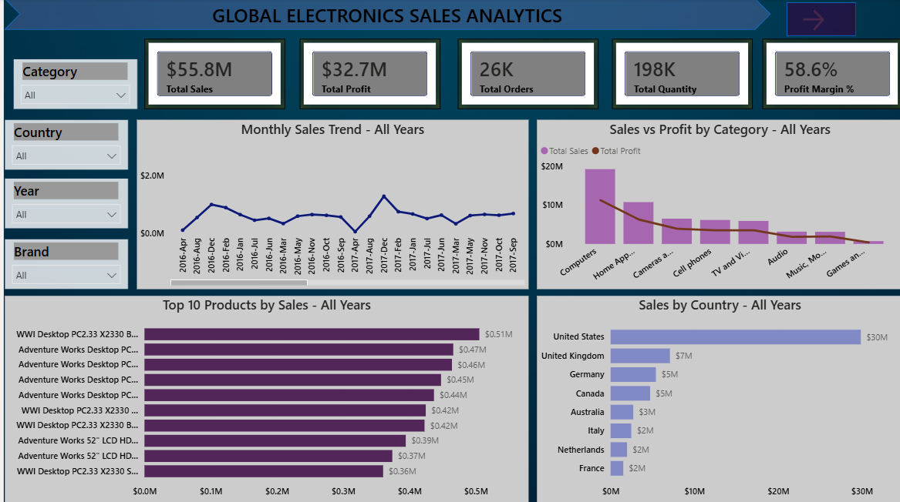

# Customer Sales Analysis Dashboard – Power BI

## 📊 Project Overview

This project is an interactive **Customer Sales Analysis Dashboard** developed using **Microsoft Power BI**.

The dashboard analyzes customer sales performance and provides interactive insights into **sales trends, customer contribution, geographic performance, and customer-level analysis**.

The project demonstrates practical skills in **data transformation, data modeling, DAX, interactive visualizations, drill-through analysis, navigation, slicers, and report design**.

---

## 🎯 Business Objective

The primary objective of this project is to analyze customer sales data and identify key sales patterns and customer-level performance.

The dashboard helps answer questions such as:

* How are sales distributed across customers?
* Which countries contribute the most to sales?
* What is the average sales value per customer?
* How does customer sales performance change over time?
* Which customers contribute significantly to overall sales?
* How can users drill into individual customer-level details?

---

## 🛠️ Tools & Technologies

* **Microsoft Power BI**
* **Power Query**
* **DAX**
* **Data Modeling**
* **Interactive Visualizations**
* **Slicers**
* **Drill-through**
* **Report Page Navigation**
* **Custom Tooltips**

---

## 🔄 Data Preparation

The dataset was prepared using **Power Query** before building the report.

The data preparation process included:

* Data type validation
* Data cleaning
* Transformation of raw data
* Preparing fields for analysis
* Creating relationships between tables
* Structuring the data model for reporting

---

## 🧩 Data Model

The project uses a structured data model to connect sales and customer-related information.

The model allows sales performance to be analyzed across different dimensions such as:

* Customer
* Country
* Product
* Date
* Sales

This structure enables efficient filtering and interactive analysis throughout the report.

---

# 📈 Dashboard Features

## 1. Customer Sales Analysis

The Customer Analysis page provides a detailed view of customer performance.

Key analyses include:

### Customer Sales Distribution

Shows how total sales are distributed across customers and helps identify high-value customers.

### Average Sales per Customer by Country

Compares the average sales generated per customer across different countries.

This helps identify countries with higher customer-level sales contribution.

### Customer Sales Trend

Analyzes how customer sales change over time and helps identify growth patterns and fluctuations.

---

## 🎛️ Interactive Filters

The dashboard uses interactive filters/slicers to allow users to dynamically explore the data.

Users can filter the report based on relevant dimensions such as:

* Customer
* Country
* Date
* Product

The visuals update dynamically based on the selected filters.

---

## 🔍 Drill-Through Analysis

The report includes **drill-through functionality** that allows users to move from a high-level sales analysis to more detailed customer-level information.

This provides a more focused view without overcrowding the main dashboard.

---

## 🧭 Page Navigation

A **navigation button** is included to provide easy movement between report sections.

This improves the user experience by allowing users to move directly to the **Customer Analysis** page.

---

## 💡 Custom Tooltip

A custom tooltip page is used to provide additional information when users hover over relevant visuals.

This allows more details to be displayed without adding unnecessary visuals to the main dashboard.

---

# 📊 Key Visualizations

The report includes visualizations designed to answer specific business questions:

| Analysis                              | Purpose                                                   |
| ------------------------------------- | --------------------------------------------------------- |
| Customer Sales Distribution           | Understand sales contribution across customers            |
| Average Sales per Customer by Country | Compare customer-level sales performance across countries |
| Customer Sales Trend                  | Analyze sales movement over time                          |
| Customer-level Drill-through          | Explore detailed customer performance                     |
| Interactive Slicers                   | Dynamically filter report data                            |
| Custom Tooltip                        | Display additional contextual information                 |

---

# 🔎 Business Insights

The dashboard enables users to:

* Identify customers contributing significantly to total sales.
* Compare customer sales performance across countries.
* Analyze changes in sales over time.
* Explore detailed customer-level performance through drill-through.
* Quickly investigate sales performance using interactive filters.
* Navigate between report sections efficiently.

---

# 🎨 Dashboard Design

The report was designed with a focus on:

* Clean and intuitive layout
* Consistent visual formatting
* Interactive filtering
* Easy navigation
* Minimal visual clutter
* Business-focused storytelling

The goal was to create a dashboard that allows users to move from **high-level sales analysis to detailed customer insights**.

---

# 📂 Repository Structure

```text
Customer-Sales-Analysis-PowerBI/
│
├── README.md
├── Customer-Sales-Analysis-PowerBI.pbix
│
└── screenshots/
    ├── overview.png
    └── customer-analysis.png
```

---

# 📷 Dashboard Preview

## Main Dashboard



## Customer Analysis


---

# 🚀 Skills Demonstrated

* Power BI
* Power Query
* DAX
* Data Cleaning
* Data Transformation
* Data Modeling
* Data Visualization
* Interactive Dashboard Development
* Slicers
* Drill-through
* Page Navigation
* Custom Tooltips
* Business Analysis
* Data Storytelling

---

# 📌 Project Highlights

### Data Preparation

Cleaned and transformed the source data using Power Query.

### Data Modeling

Created a structured data model to support interactive analysis.

### DAX

Created measures and calculations required for sales and customer analysis.

### Interactive Reporting

Implemented slicers, drill-through, navigation buttons, and custom tooltips.

### Customer Analytics

Built dedicated analysis to understand customer sales distribution, country-level performance, and sales trends.

---

# 👩‍💻 Project Purpose

This project was developed as a **portfolio project to demonstrate practical Power BI and data analytics skills** for a Data Analyst role.

It demonstrates the complete workflow from **data preparation and modeling to DAX calculations, visualization, and interactive business intelligence reporting**.
